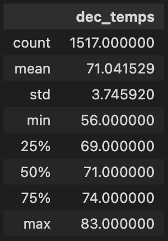
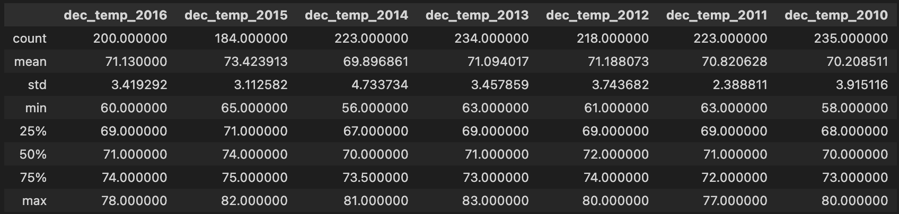

# Oahu, Hawaii Temperature Analysis

## Project Overview

### Purpose

The purpose of this project is to use `Python`, `SQLAlchemy`, and `Pandas` to provide a brief temperature analysis of Oahu, Hawaii during the months of **June** and **December**. This information is being used to determine whether the analyzed location would be a good location for a surfing business

## Results

### Analysis

June: 


December:



### Brief Comparison

- December is only 3.9 degrees Fahrenheit colder on average than June.
- December's coldest recorded temperature is 8 degrees Fahrenheit colder than June's coldest recorded temperature.
- December's warmest recorded temperature is only 2 degrees colder than June's warmest recorded temperature.

## Summary

### Discussion

This analysis shows that the weather in this location is fairly consistent when considering the average temperatures from June and December. The coldest day in December, measured at 56 degrees Fahrenheit, is 15 degrees Fahrenheit below the monthly average. This means that it doesn't happen much too often, and would be a day that could be used to clean up shop or to have event sign ups, or anything that can fill the space of a not-so-common colder day.

December's average temperature is 3.9 degrees Fahrenheit colder than the average temperatures recorded in June. This point of analysis provides some indication of consistency between the temperature differences at opposite times of the year.

Based on temperature, this place would make for a great place to set up a surfing business.

### Additional Analysis

I decided to do the similar queries, but to query by year instead.

June:


December:




I did this by iterating through a list of known years that existed within the dataset:
```python
# Establish years list to iterate through, and create dictionaries for the storage of information
years_list = ["2010", "2011", "2012", "2013", "2014", "2015", "2016", "2017"]
june_temps_years = {}
dec_temps_years = {}

# Iterate through the years list and extract the data for each year and create a list of temperature recordings for each year
for year in years_list:
    june_year = f'june_temp_{year}'
    june_temps_years[june_year] = session.query(Measurement.tobs).\
        filter(extract("year", Measurement.date) == year).\
        filter(extract("month", Measurement.date) == "06").all()

    june_temps_years[june_year] = list(np.ravel(june_temps_years[june_year]))


    dec_year = f'dec_temp_{year}'
    dec_temps_years[dec_year] = session.query(Measurement.tobs).\
        filter(extract("year", Measurement.date) == year).\
        filter(extract("month", Measurement.date) == "12").all()

    dec_temps_years[dec_year] = list(np.ravel(dec_temps_years[dec_year]))
```

Since I was only interested in the summary data, I created new data frames out of just the summaries, with some bonus December cleanup:
```python
# Create the June data frame which will store the summaries of each year
june_years_df = pd.DataFrame()

for key, value in june_temps_years.items():
    june_years_df[key] = pd.DataFrame(value).describe()

june_years_df = june_years_df[sorted(june_years_df, reverse=True)]

# There is no data for 2017 for December, so clean up any empty data lists
keys_to_remove = []
for key, value in dec_temps_years.items():
    if value == []:
        keys_to_remove.append(key)

for key in keys_to_remove:
    del dec_temps_years[key]

# Create the December data frame which will store the summaries of each year
dec_years_df = pd.DataFrame()

for key, value in dec_temps_years.items():
    dec_years_df[key] = pd.DataFrame(value).describe()

dec_years_df = dec_years_df[sorted(dec_years_df,reverse=True)]
```
